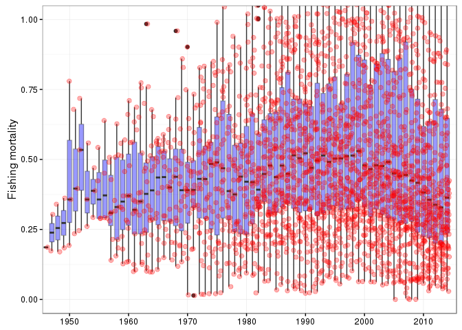
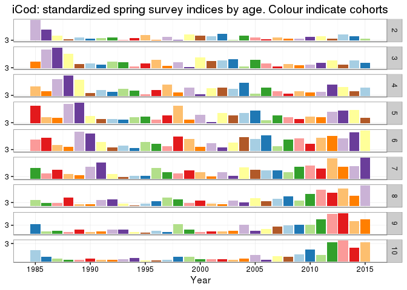
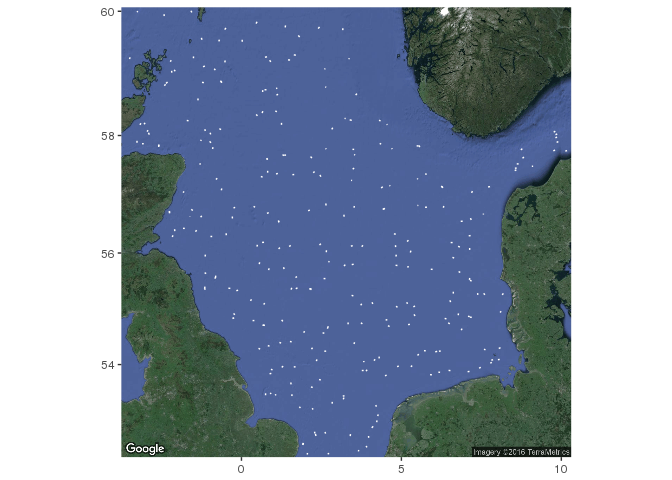
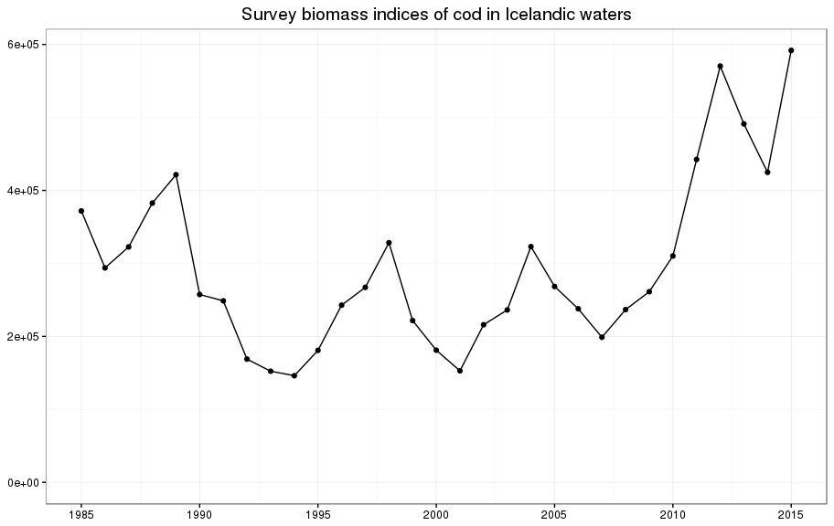

# TCRENV 2016

# Notes to participants

* 2016-02-20: A webpage were the course material is being compiled is currently located [here](http://www.hafro.is/~einarhj/education/tcrenv2016).


# On this space

This space will host the nitty gritty part of the upcoming ICES training course in R.

* Information on registration can be found on the [ICES webpages](http://ices.dk/news-and-events/Training/Pages/R-environment.aspx)
* The introctuction to the course was provided as [“ICES news”](http://ices.dk/news-and-events/news-archive/news/Pages/Learning-the-language-of-R.aspx)

Upfront and in the spirit of the course we would like to emphasise that the source code for the text you are now reading can be found on this webspace as [README.Rmd](https://raw.githubusercontent.com/fishvice/tcrenv2016/master/README.Rmd). If you have [RStudio](https://www.rstudio.com) already installed on your computer and some minimal experience in using it you should be able to regenerate this whole document on your local computer using the referred file. If you can not, do not hesitate to send an email to einar.hjorleifsson@gmail.com

## Dates and venues
___

* 2016-02-29 10:00 Monday - 2016-03-05 15:00 Friday
* ICES HQ, Copenhagen, Denmark

## A tentative schedule
___

Tentative here means that the schedule will be subject to changes, but to only a minor extent the context. 

### Day 1 - Monday

* Introduction:
    - Rstudio and R projects
    - knitr, markdown, document writing (html, pdf,  docx)
    - reproducible analysis using R
* Getting data into R and out of R:
    - from ones own computer (text files, excel, ...)
    - from the web
    - from API's (ICES Webservices)
    - from databases (Ram's online Postgres database)
* The grammar of data and graphics:
    - Introduction to ggplot2
    - Introduction to dplyr

### Day 2 - Tuesday

* The grammar of data and graphics - continued:
    - Exploratory data analysis and visualization
* Working with characters and dates
* The base R equivalence

### Day 3 - Wednesday

* GIS in R
    - using ggplot2 and ggmap
    - using leaflet
* Applied project(s) - From "messy" data to a final report using reproducible approach based on case examples
    - candidate: abundance and biomass indices starting with ICES DATRAS data

### Day 4 - Thursday

* Applied project - continued

### Day 5 - Friday
* The fundamentals of functions and package writing
    - Fundamental of functions and documentation
    - Directory structure and a minimal example
    - Version control (git) and social coding (www.github.com)

> Daily routine: Each day will be split up into group discussion of the topics/assignments covered the previous day, introduction lectures of the day's topics followed by practical assignments. Emphasis will be put on cooperative work and code sharing (including difficulties/stumbling blocks) among participants.

## Some examples of the flavour of the code we will use

### Installation of needed libraries

Most of the code below is based on functions from packages on [cran](https://cran.r-project.org). Only exception are functions used to accesss ICES webservices. These are aggregated in a developmental package `wices` that resides on [github](https://github.com/einarhjorleifsson/wices). The code use to install that package is the first line below.


```r
devtools::install_github("einarhjorleifsson/wices")
```

Loading of needed packages:


```r
library(wices)
library(dplyr)
library(tidyr)
library(reshape2)
library(RColorBrewer)
library(ggplot2)
library(ggmap)
```

### ICES stocks - mortality trends

Get list of stock names available in year 2015 and create a loop to get all the stock summary data from ices.dk via the [ICES standard graph webservice API](http://standardgraphs.ices.dk/standardgraphswebservices.asmx):

```r
stocks <- wices::get_list_stock(year = 2015) %>% 
  filter(Status == "Published",
         !FishStockName %in% c("lin-icel","tur-nsea"),
         SpeciesName != "Mallotus villosus")

rby <- NULL
for (i in c(1:nrow(stocks))) {
  x <- wices::get_summary_table(stocks$FishStockName[i], year = 2015)
  rby <- bind_rows(rby,x)
}
```

Some minor "cleaning":

```r
rby <- 
  rby %>% 
  filter(Year <= 2015) %>% 
  mutate(F = ifelse(Year == 2015, NA, F)) %>% 
  left_join(stocks)
```


A "glimpse" of what the table looks like:

```r
rby
```

```
## Source: local data frame [3,175 x 22]
## 
##     Year recruitment high_recruitment low_recruitment low_SSB   SSB
##    (int)       (dbl)            (dbl)           (dbl)   (dbl) (dbl)
## 1   1980           0               NA              NA    1.20  1.20
## 2   1981           0               NA              NA    1.18  1.18
## 3   1982           0               NA              NA    1.15  1.15
## 4   1983           0               NA              NA    1.11  1.11
## 5   1984           0               NA              NA    1.08  1.08
## 6   1985           0               NA              NA    1.07  1.07
## 7   1986           0               NA              NA    1.06  1.07
## 8   1987           0               NA              NA    1.02  1.02
## 9   1988           0               NA              NA    0.90  0.92
## 10  1989           0               NA              NA    0.78  0.81
## ..   ...         ...              ...             ...     ...   ...
## Variables not shown: high_SSB (dbl), catches (dbl), landings (dbl),
##   discards (dbl), low_F (dbl), F (dbl), high_F (dbl), fishstock (chr),
##   AssessmentYear (int), key (int), .id (chr), FishStockName (chr),
##   StockDescription (chr), Status (chr), SpeciesName (chr), EcoRegion (chr)
```

A boxplot of mortality trends with individual values superimposed:

```r
rby %>% 
  ggplot(aes(factor(Year), F)) +
  theme_bw() +
  geom_boxplot(fill = "blue", alpha = 0.4) +
  geom_jitter(col = "red", size = 2, alpha = 0.3) +
  coord_cartesian(ylim = c(0,1)) +
  scale_x_discrete(breaks = seq(1950, 2010, by = 10)) +
  labs(x = NULL, y = "Fishing mortality")
```




### Survey indices at age "brought to live"

Read table directly from the net:

```r
survey <- readr::read_csv("http://data.hafro.is/assmt/2015/cod/smb.csv")
```

A "glimpse" of the table:

```r
survey
```

```
## Source: local data frame [31 x 11]
## 
##     Year     1      2      3      4     5     6     7     8     9    10
##    (int) (dbl)  (dbl)  (dbl)  (dbl) (dbl) (dbl) (dbl) (dbl) (dbl) (dbl)
## 1   1985 16.54 110.48  35.41  48.25 64.59 22.95 15.26  5.04  3.39  1.84
## 2   1986 15.07  60.58  95.95  22.46 21.51 27.44  7.17  2.80  0.93  0.82
## 3   1987  3.65  28.29 104.44  82.67 21.41 12.76 12.94  2.79  0.98  0.42
## 4   1988  3.45   7.06  72.51 103.56 69.54  8.39  6.41  7.23  0.67  0.28
## 5   1989  4.04  16.40  22.06  79.90 74.16 39.11  4.85  1.71  1.42  0.27
## 6   1990  5.56  11.79  26.10  14.18 27.91 35.22 16.74  1.75  0.58  0.48
## 7   1991  3.95  16.02  18.20  30.24 15.49 18.94 22.45  4.91  0.94  0.31
## 8   1992  0.71  16.91  33.60  18.95 16.66  6.87  6.35  5.78  1.49  0.23
## 9   1993  3.57   4.77  30.87  36.79 13.53 10.61  2.42  2.03  1.40  0.41
## 10  1994 14.40  14.96   9.04  26.91 22.43  6.09  3.96  0.80  0.53  0.52
## ..   ...   ...    ...    ...    ...   ...   ...   ...   ...   ...   ...
```

Making it graphical and "informical":

```r
survey <-
  survey %>% 
  gather(age, index, -Year) %>% 
  mutate(age = as.integer(as.character(age)),
         yc = Year - age) %>% 
  filter(age %in% 2:10)

PAIRED <- rep(brewer.pal(12,"Paired"),100)
n <- length(unique(survey$yc))
ggplot(survey,aes(Year,index,fill=factor(yc))) +
  theme_bw() +
  geom_bar(stat="identity") + 
  scale_fill_manual(values=PAIRED[1:n])  + 
  theme(legend.position = "none") +
  labs(X = NULL, y = NULL, title = "iCod: standardized spring survey indices by age. Colour indicate cohorts") +
  facet_grid(age ~ ., scale="free_y") +
  scale_y_continuous(breaks = c(3)) +
  scale_x_continuous(breaks = seq(1985, 2015, by = 5))
```



_The graph above contain a lot of detail stories. The bottom line, that explains the increase in the abundance indices of older fish with time, despite no increase in recruitment abuncance, is management action in reducing fishing mortality over this time period through TAC control_

### Shaking hands with [DATRAS](http://ices.dk/marine-data/data-portals/Pages/DATRAS.aspx)

Get station information ("hh" data) for "NS-IBTS", first quarter in 2015 via the ICES DATRAS webservice API and plot each tow trajectories:

```r
st <- wices::get_hh_data(survey = "NS-IBTS",
                         year = 2015,
                         quarter = 1) %>% 
  select(shootlat, shootlong, haullat, haullong)
```

```
## xmlns: URI ices.dk.local/DATRAS is not absolute
```

```r
st$id <- 1:nrow(st)
```

Take a peek at the data:

```r
head(st)
```

```
##   shootlat shootlong haullat haullong id
## 1   57.536    -1.281  57.515   -1.306  1
## 2   57.806    -0.893  57.776   -0.902  2
## 3   58.046    -0.983  58.019   -0.961  3
## 4   58.209    -3.011  58.187   -3.047  4
## 5   58.087    -2.919  58.065   -2.952  5
## 6   57.864    -3.055  57.863   -3.109  6
```

Plot the stuff:

```r
p <- get_map(location = c(mean(st$shootlong), mean(st$shootlat)),
             zoom = 6,
             maptype = "satellite")
ggmap(p) +
  geom_segment(data = st, aes(x = shootlong,
                              xend = haullong,
                              y = shootlat,
                              yend = haullat),
               color = "white") +
  labs(x = NULL, y = NULL)
```



### Calculate survey biomass indices from "raw" tables

Lets calculate a biomass index from a bottom trawl survey. The case is to illustrate that one can achieve this by using only `dplyr`-verbs.

First, read in some standard survey database tables (Icelandic in this case):

```r
Station     <- read.csv("http://www.hafro.is/~einarhj/data/tcrenv2016/Station.csv")
Length      <- read.csv("http://www.hafro.is/~einarhj/data/tcrenv2016/Length.csv")
Subsampling <- read.csv("http://www.hafro.is/~einarhj/data/tcrenv2016/Subsampling.csv")
Stratas     <- read.csv("http://www.hafro.is/~einarhj/data/tcrenv2016/Stratas.csv")
```

Lets for now do this for one species:

```r
SPECIES <- 1                         # Cod
```

Some constants and restrictions of extremes:

```r
# constants
std.towlength <- 4                                   # seamiles
min.towlength <- std.towlength / 2
max.towlength <- std.towlength * 2
std.towwidth  <- 17                                  # meters
area.swept    <- std.towlength * std.towwidth/1852   # square miles
```

The calculation:

```r
ss <-
  Subsampling %>% 
  filter(species %in% SPECIES) %>%
  mutate(r = n.total/n.measured) %>% 
  select(id, r)
# filter the length measurements for species in question
#   and summarise the counts
d <- Length %>% 
  filter(species == SPECIES) %>%
  # a double precaution, in case length bins by sex
  group_by(id, length) %>%
  summarize(n = sum(n)) %>% 
  ungroup() %>% 
  left_join(ss, by="id") %>%
  mutate(n = n * r,
         b = n * 0.01 * length^3) %>% 
  select(-r) %>% 
  # summarise the abundance and biomass measured at each station
  group_by(id) %>% 
  summarise(n = sum(n),
            b = sum(b)) %>% 
  ungroup() %>% 
  # join with the station table information
  right_join(Station %>% select(id, date1, towlength, strata), by = "id") %>% 
  # make assumptions about "extreme" tow lengths
  mutate(towlength = ifelse(towlength < min.towlength, min.towlength, towlength),
         towlength = ifelse(towlength > max.towlength, max.towlength, towlength),
         towlength = ifelse(is.na(towlength),4, towlength),
         year = lubridate::year(date1),
         # standardize abundance to standard area swept (4 seamiles x 17 m /1852 m per mile)
         #  units will be in abundance per square seamile
         #   the ifelse function if for station were no fish was caught
         n  = ifelse(is.na(n),0,n) / towlength  * std.towlength * std.towwidth/1852,
         b  = ifelse(is.na(b),0,b) / towlength  * std.towlength * std.towwidth/1852) %>% 
  select(-date1) %>% 
  group_by(year, strata) %>%
  summarise(N  = n(),             # number of tows
            n_m  = mean(n),       # mean abundance per square mile within a strata
            b_m  = mean(b)) %>%   # mean biomass   per square mile within a within a strata
  ungroup() %>% 
  left_join(Stratas %>% select(strata, rall.area), by = "strata") %>%
  # group_by(strata, length) %>%
  mutate(r  = rall.area/1.864^2 / area.swept,  # 
         n     = n_m  * r,
         b     = b_m  * r) %>% 
  group_by(year) %>% 
  summarise(n = sum(n),
            b = sum(b))
```

And now for a little plot:

```r
d %>% 
  ggplot(aes(x = year, y = b/10e3)) +
  theme_bw() +
  geom_line() +
  geom_point() +
  scale_x_continuous(breaks = seq(1985, 2015, by = 5)) +
  expand_limits(y = 0) +
  labs(x = NULL, y = NULL, title = "Survey biomass indices of cod in Icelandic waters")
```




### More examples may be added ...

## Context, objective and level
___


### Context

The R language is becoming the _Lingua franca_ both in data science in general as well as within the ICES community. Recent advancements within R have resulted in that R can no longer be considered as a specific statistical programming language but as a general scientific working environment. This broader environment has resulted in the R has become a natural component of reproducible data analysis and document writing.

Various R packages (e.g. FLR, DATRAS, MSY, SURBAR, VMStools) have often been the backbone of ICES training course and/or workshops. These packages as well as courses are geared towards solving specific pending tasks that tend to come with requirements that the participants are reasonable proficient in basic R and that the input data are correctly formatted and available. Any of these requirements have been seen to pose problems.

The course is aimed at covering the fundamental/generic basis of the grammar of data and graphics as well reproducible document writing where R is used as the sole working medium. Recent developments in the R community that are of interest to fisheries science will also be described.

### Objective

The objective of the course is to provide participants with a solid foundation in efficient use of the R environment using various typical and familiar fisheries data sets (landings data, catch data, survey data and tagging data) as case examples. Emphasis will be put on data munging and literate programming starting with "raw" data (individual stations, individual fish measurements) and culminating with deliverance of publishable output produced from a single coded document file.

By the end of the course, the participants:

  * Will be able to import data from multitude of sources computer (i.e. own text files, excel, access, sql databases) and via the web.
  * Will be able to clean, manipulate, explore, summarize and graph data. This includes being able to:
      - Apply best practices in data preparation
      - Present results graphically, highlighting significant results
      - Merge, slice and dice various datasets
  * Will be able to apply the principle of reproducible analysis and report writing from A through Z which are then deliverable through any of the current three common deliverable formats: .html, .pdf and .docx.
  * Will be able to produce own functions and understand the principles of creating R packages as well participate in social coding (through www.github.com).

### Level

The course is targeted at fisheries scientist with already have some basic experience in R but are yet not proficient enough to write fluently code for data manipulation, exploration and writing own functions. We believe that some part of the course would also be beneficial to those that are currently productively using R in fisheries science but may along the way have skipped the basics or are unaware of recent advancements in the R environment.


## Lecturers
___


  * Bjarki Þór Elvarsson, Marine Research Institute, Iceland
      - Bjarki is a statistician in the Fisheries Advisory Section of the Marine Research Institute, Reykjavík Iceland. He recently finished his phd in statistical methods related to stock assessment models. He has been a member of the Icelandic delegation to the scientific council of International whaling commission since 2010 and participated in various ICES working group meetings since 2013. R has been in his main working environment since 2004. 
  * Einar Hjörleifsson, Marine Research Institute, Iceland
      - Einar is a fisheries scientist in Fisheries Advisory Section of the Marine Research Institute, Reykjavík Iceland. He has been involved in various ICES works since 1996 that spans the whole spectrum from ACFM/ACOM membership up to working group participation. In the early 2000's he taught stock assessment at ICES with Dankert Skagen for three consequtive years. He has also been involved in the United Nation University Fisheries Training Program teaching stock assessment. R has been his primary working environment since 2009.

## Appendix


```r
devtools::session_info()
```

```
## Session info --------------------------------------------------------------
```

```
##  setting  value                       
##  version  R version 3.2.3 (2015-12-10)
##  system   x86_64, linux-gnu           
##  ui       X11                         
##  language (EN)                        
##  collate  is_IS.UTF-8                 
##  tz       Atlantic/Reykjavik          
##  date     2016-02-20
```

```
## Packages ------------------------------------------------------------------
```

```
##  package      * version    date      
##  assertthat     0.1        2013-12-06
##  colorspace     1.2-6      2015-03-11
##  curl           0.9.5      2016-01-23
##  DBI            0.3.1      2014-09-24
##  devtools       1.10.0     2016-01-23
##  digest         0.6.9      2016-01-08
##  dplyr        * 0.4.3      2015-09-01
##  evaluate       0.8        2015-09-18
##  formatR        1.2.1      2015-09-18
##  geosphere      1.5-1      2015-12-18
##  ggmap        * 2.6.1      2016-01-23
##  ggplot2      * 2.0.0.9001 2016-02-16
##  gtable         0.1.2.9000 2016-02-16
##  htmltools      0.3.3      2016-02-13
##  httr           1.1.0      2016-01-28
##  jpeg           0.1-8      2014-01-23
##  knitr          1.12.3     2016-01-22
##  labeling       0.3        2014-08-23
##  lattice        0.20-33    2015-07-14
##  lazyeval       0.1.10     2015-01-02
##  lubridate      1.5.0      2015-12-03
##  magrittr       1.5        2014-11-22
##  mapproj        1.2-4      2015-08-03
##  maps           3.0.2      2016-01-04
##  memoise        1.0.0      2016-01-29
##  munsell        0.4.3      2016-02-13
##  plyr           1.8.3      2015-06-12
##  png            0.1-7      2013-12-03
##  proto          0.3-10     2012-12-22
##  R6             2.1.2      2016-01-26
##  RColorBrewer * 1.1-2      2014-12-07
##  Rcpp           0.12.3     2016-01-10
##  readr          0.2.2      2015-10-22
##  reshape2     * 1.4.1      2014-12-06
##  RgoogleMaps    1.2.0.7    2015-01-21
##  rjson          0.2.15     2014-11-03
##  RJSONIO        1.3-0      2014-07-28
##  rmarkdown      0.9.5      2016-02-13
##  scales         0.3.0.9000 2016-02-16
##  sp             1.2-2      2016-02-05
##  stringi        1.0-1      2015-10-22
##  stringr        1.0.0      2015-04-30
##  tidyr        * 0.4.1      2016-02-05
##  wices        * 0.0.2.9001 2016-01-15
##  XML            3.98-1.3   2015-06-30
##  yaml           2.1.13     2014-06-12
##  source                                  
##  CRAN (R 3.2.3)                          
##  CRAN (R 3.2.3)                          
##  CRAN (R 3.2.3)                          
##  CRAN (R 3.2.0)                          
##  CRAN (R 3.2.3)                          
##  CRAN (R 3.2.3)                          
##  CRAN (R 3.2.3)                          
##  CRAN (R 3.2.3)                          
##  CRAN (R 3.2.3)                          
##  CRAN (R 3.2.3)                          
##  CRAN (R 3.2.3)                          
##  Github (hadley/ggplot2@025d198)         
##  Github (hadley/gtable@6c7b22c)          
##  Github (rstudio/htmltools@78c5072)      
##  CRAN (R 3.2.3)                          
##  CRAN (R 3.2.3)                          
##  CRAN (R 3.2.3)                          
##  CRAN (R 3.2.3)                          
##  CRAN (R 3.2.3)                          
##  CRAN (R 3.2.3)                          
##  CRAN (R 3.2.3)                          
##  CRAN (R 3.2.3)                          
##  CRAN (R 3.2.3)                          
##  CRAN (R 3.2.3)                          
##  CRAN (R 3.2.3)                          
##  CRAN (R 3.2.3)                          
##  CRAN (R 3.2.3)                          
##  CRAN (R 3.2.3)                          
##  CRAN (R 3.2.3)                          
##  CRAN (R 3.2.3)                          
##  CRAN (R 3.2.3)                          
##  CRAN (R 3.2.3)                          
##  CRAN (R 3.2.3)                          
##  CRAN (R 3.2.3)                          
##  CRAN (R 3.2.3)                          
##  CRAN (R 3.2.3)                          
##  CRAN (R 3.2.3)                          
##  Github (rstudio/rmarkdown@b24f7e7)      
##  Github (hadley/scales@ad60fbe)          
##  CRAN (R 3.2.3)                          
##  CRAN (R 3.2.3)                          
##  CRAN (R 3.2.3)                          
##  CRAN (R 3.2.3)                          
##  Github (einarhjorleifsson/wices@37c3742)
##  CRAN (R 3.2.3)                          
##  CRAN (R 3.2.3)
```
