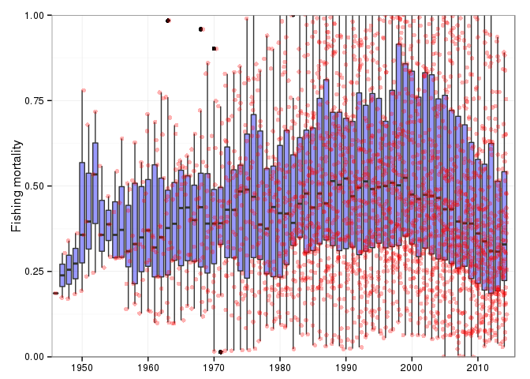
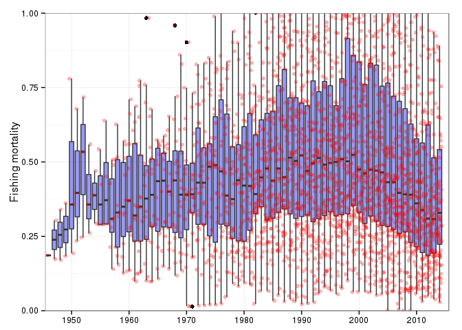
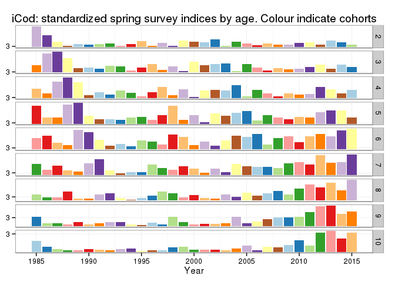

# TCRENV 2016


ICES Training Course in the R ENVironment  

## Dates and venues
___

* 2016-02-29 09:00 Monday - 2016-03-05 16:00 Friday
* ICES HQ, Copenhagen, Denmark

## A tentative schedule
___

Tentative here means that the schedule will be subject to changes, but to only a minor extent the context. 

### Day 1 - Monday

* Introduction:
    - Rstudio and R projects
    - knitr, markdown, document writing (html, pdf,  docx)
    - reproducible analysis using R
* Getting data into R and out of R:
    - from ones own computer (text files, excel, ...)
    - from the web
    - from API's (ICES Webservices)
    - from databases (Ram's online Postgres database)
* The grammar of data and graphics:
    - Introduction to ggplot2
    - Introduction to dplyr

### Day 2 - Tuesday

* The grammar of data and graphics - continued:
    - Exploratory data analysis and visualization
* Working with characters and dates
* The base R equivalence

### Day 3 - Wednesday

* GIS in R
    - using ggplot2 and ggmap
    - using leaflet
* Applied project(s) - From "messy" data to a final report using reproducible approach based on case examples
    - candidate: abundance and biomass indices starting with ICES DATRAS data

### Day 4 - Thursday

* Applied project - continued

### Day 5 - Friday
* The fundamentals of functions and package writing
    - Fundamental of functions and documentation
    - Directory structure and a minimal example
    - Version control (git) and social coding (www.github.com)

> Daily routine: Each day will be split up into group discussion of the topics/assignments covered the previous day, introduction lectures of the day's topics followed by practical assignments. Emphasis will be put on cooperative work and code sharing (including difficulties/stumbling blocks) among participants.

## Examples of what we may do

### ICES stocks - mortality trends


```r
# devtools::install_github("einarhjorleifsson\wices")
library(wices)
library(DT)
library(dplyr)
library(tidyr)
library(reshape2)
library(RColorBrewer)
library(ggplot2)
```

Get list of stock names available in year 2015 and create a loop to get all the stock summary data from ices.dk via the [ICES standard graph webservice API](http://standardgraphs.ices.dk/standardgraphswebservices.asmx):

```r
stocks <- wices::get_list_stock(year = 2015) %>% 
  filter(Status == "Published",
         !FishStockName %in% c("lin-icel","tur-nsea"),
         SpeciesName != "Mallotus villosus")

rby <- NULL
for (i in c(1:nrow(stocks))) {
  x <- wices::get_summary_table(stocks$FishStockName[i], year = 2015)
  rby <- bind_rows(rby,x)
}
```

Some minor "cleaning":

```r
rby <- 
  rby %>% 
  filter(Year <= 2015) %>% 
  mutate(F = ifelse(Year == 2015, NA, F)) %>% 
  left_join(stocks)
```


A boxplot of mortality trends with individual values superimposed:

```r
rby %>% 
  ggplot(aes(factor(Year), F)) +
  theme_bw() +
  geom_boxplot(fill = "blue", alpha = 0.4) +
  geom_jitter(col = "red", size = 2, alpha = 0.3) +
  coord_cartesian(ylim = c(0,1)) +
  scale_x_discrete(breaks = seq(1950, 2010, by = 10)) +
  labs(x = NULL, y = "Fishing mortality")
```

 

Trends by "major" species:

```r
rby %>% 
  filter(SpeciesName %in% c("Clupea harengus",
                            "Gadus morhua",
                            "Melanogrammus aeglefinus",
                            "Pleuronectes platessa",
                            "Pollachius virens",
                            "Solea solea")) %>% 
  ggplot(aes(Year, F)) +
  theme_bw() +
  geom_hline(yintercept = 0.2, col = "yellow") +
  geom_line(aes(group = FishStockName), col = "red", alpha = 0.3) +
  geom_point(alpha = 0.2, col = "red") +
  stat_smooth() +
  facet_wrap(~ SpeciesName, scale = "free_y") +
  coord_cartesian(ylim = c(0,1.5)) +
  labs(x = NULL, y = NULL, title = "Fishing mortality trends in different species")
```

 

### Survey indices at age "brought to live"


```r
PAIRED <- rep(brewer.pal(12,"Paired"),100)
survey <- readr::read_csv("http://data.hafro.is/assmt/2015/cod/smb.csv") %>% 
  gather(age, oU, -Year) %>% 
  mutate(age = as.integer(as.character(age)),
         yc = Year - age) %>% 
  filter(age %in% 2:10)
datatable(survey)
```

<!--html_preserve--><div id="htmlwidget-6575" style="width:100%;height:auto;" class="datatables"></div>
<script type="application/json" data-for="htmlwidget-6575">{"x":{"data":[["1","2","3","4","5","6","7","8","9","10","11","12","13","14","15","16","17","18","19","20","21","22","23","24","25","26","27","28","29","30","31","32","33","34","35","36","37","38","39","40","41","42","43","44","45","46","47","48","49","50","51","52","53","54","55","56","57","58","59","60","61","62","63","64","65","66","67","68","69","70","71","72","73","74","75","76","77","78","79","80","81","82","83","84","85","86","87","88","89","90","91","92","93","94","95","96","97","98","99","100","101","102","103","104","105","106","107","108","109","110","111","112","113","114","115","116","117","118","119","120","121","122","123","124","125","126","127","128","129","130","131","132","133","134","135","136","137","138","139","140","141","142","143","144","145","146","147","148","149","150","151","152","153","154","155","156","157","158","159","160","161","162","163","164","165","166","167","168","169","170","171","172","173","174","175","176","177","178","179","180","181","182","183","184","185","186","187","188","189","190","191","192","193","194","195","196","197","198","199","200","201","202","203","204","205","206","207","208","209","210","211","212","213","214","215","216","217","218","219","220","221","222","223","224","225","226","227","228","229","230","231","232","233","234","235","236","237","238","239","240","241","242","243","244","245","246","247","248","249","250","251","252","253","254","255","256","257","258","259","260","261","262","263","264","265","266","267","268","269","270","271","272","273","274","275","276","277","278","279"],[1985,1986,1987,1988,1989,1990,1991,1992,1993,1994,1995,1996,1997,1998,1999,2000,2001,2002,2003,2004,2005,2006,2007,2008,2009,2010,2011,2012,2013,2014,2015,1985,1986,1987,1988,1989,1990,1991,1992,1993,1994,1995,1996,1997,1998,1999,2000,2001,2002,2003,2004,2005,2006,2007,2008,2009,2010,2011,2012,2013,2014,2015,1985,1986,1987,1988,1989,1990,1991,1992,1993,1994,1995,1996,1997,1998,1999,2000,2001,2002,2003,2004,2005,2006,2007,2008,2009,2010,2011,2012,2013,2014,2015,1985,1986,1987,1988,1989,1990,1991,1992,1993,1994,1995,1996,1997,1998,1999,2000,2001,2002,2003,2004,2005,2006,2007,2008,2009,2010,2011,2012,2013,2014,2015,1985,1986,1987,1988,1989,1990,1991,1992,1993,1994,1995,1996,1997,1998,1999,2000,2001,2002,2003,2004,2005,2006,2007,2008,2009,2010,2011,2012,2013,2014,2015,1985,1986,1987,1988,1989,1990,1991,1992,1993,1994,1995,1996,1997,1998,1999,2000,2001,2002,2003,2004,2005,2006,2007,2008,2009,2010,2011,2012,2013,2014,2015,1985,1986,1987,1988,1989,1990,1991,1992,1993,1994,1995,1996,1997,1998,1999,2000,2001,2002,2003,2004,2005,2006,2007,2008,2009,2010,2011,2012,2013,2014,2015,1985,1986,1987,1988,1989,1990,1991,1992,1993,1994,1995,1996,1997,1998,1999,2000,2001,2002,2003,2004,2005,2006,2007,2008,2009,2010,2011,2012,2013,2014,2015,1985,1986,1987,1988,1989,1990,1991,1992,1993,1994,1995,1996,1997,1998,1999,2000,2001,2002,2003,2004,2005,2006,2007,2008,2009,2010,2011,2012,2013,2014,2015],[2,2,2,2,2,2,2,2,2,2,2,2,2,2,2,2,2,2,2,2,2,2,2,2,2,2,2,2,2,2,2,3,3,3,3,3,3,3,3,3,3,3,3,3,3,3,3,3,3,3,3,3,3,3,3,3,3,3,3,3,3,3,4,4,4,4,4,4,4,4,4,4,4,4,4,4,4,4,4,4,4,4,4,4,4,4,4,4,4,4,4,4,4,5,5,5,5,5,5,5,5,5,5,5,5,5,5,5,5,5,5,5,5,5,5,5,5,5,5,5,5,5,5,5,6,6,6,6,6,6,6,6,6,6,6,6,6,6,6,6,6,6,6,6,6,6,6,6,6,6,6,6,6,6,6,7,7,7,7,7,7,7,7,7,7,7,7,7,7,7,7,7,7,7,7,7,7,7,7,7,7,7,7,7,7,7,8,8,8,8,8,8,8,8,8,8,8,8,8,8,8,8,8,8,8,8,8,8,8,8,8,8,8,8,8,8,8,9,9,9,9,9,9,9,9,9,9,9,9,9,9,9,9,9,9,9,9,9,9,9,9,9,9,9,9,9,9,9,10,10,10,10,10,10,10,10,10,10,10,10,10,10,10,10,10,10,10,10,10,10,10,10,10,10,10,10,10,10,10],[110.48,60.58,28.29,7.06,16.4,11.79,16.02,16.91,4.77,14.96,29.31,5.46,22.26,5.38,33.1,27.71,23.54,38.63,4.22,26.45,17.8,7.43,19.01,12.41,12.63,21.54,23,11.02,33.68,24.23,10.95,35.41,95.95,104.44,72.51,22.06,26.1,18.2,33.6,30.87,9.04,24.8,42.72,13.59,30,7.03,55.16,36.56,41.48,46.62,8.11,41.72,25.07,9.07,23.03,16.58,18.92,27.58,39.31,18.18,38.84,28.05,48.25,22.46,82.67,103.56,79.9,14.18,30.24,18.95,36.79,26.91,9.06,29.71,56.82,16.19,42.64,7,38.39,40.67,36.91,64.57,9.97,40.55,22.87,9.86,22.8,18.12,20.14,56.94,44.44,23.73,42.42,64.59,21.51,21.41,69.54,74.16,27.91,15.49,16.66,13.53,22.43,24.53,13.22,29.85,63.32,13.33,30.79,5.08,37.25,29.17,38.41,46.43,11.72,30.04,22.38,15.68,24.64,23.06,42.02,47.22,47.59,21.27,22.95,27.44,12.76,8.39,39.11,35.22,18.94,6.87,10.61,6.09,18.44,15.35,9.96,29.98,24.82,8.69,15.85,7.45,17.73,27.81,25.01,31.56,10.1,22.95,26.01,14.13,26.56,31.24,25.96,38.28,41.94,15.26,7.17,12.94,6.41,4.85,16.74,22.45,6.35,2.42,3.96,4.02,15.1,9.47,7,11.99,8.82,3.55,8.98,4.11,15.92,12.12,11.62,11.39,9.44,16.69,18.35,14.66,28.36,17.22,17.79,29.27,5.04,2.8,2.79,7.23,1.71,1.75,4.91,5.78,2.03,0.8,1.91,4.2,7.31,5.77,2.6,4.57,2.16,1.66,4.78,3.03,6.47,4.1,6.11,8.02,4.85,9.91,13.33,10.79,14.53,8.44,16.94,3.39,0.93,0.98,0.67,1.42,0.58,0.94,1.49,1.4,0.53,0.38,1.14,0.61,3.32,1.47,0.56,0.89,0.81,1.13,3.21,1.01,1.62,2.45,3.05,3.14,3.26,5.02,7.06,7.28,4.37,5.12,1.84,0.82,0.42,0.28,0.27,0.48,0.31,0.23,0.41,0.52,0.2,0.21,0.24,0.75,0.82,0.34,0.33,0.34,0.23,0.51,1.03,0.28,0.87,0.78,1.15,1.97,1.04,3.22,3.48,2.25,3.19],[1983,1984,1985,1986,1987,1988,1989,1990,1991,1992,1993,1994,1995,1996,1997,1998,1999,2000,2001,2002,2003,2004,2005,2006,2007,2008,2009,2010,2011,2012,2013,1982,1983,1984,1985,1986,1987,1988,1989,1990,1991,1992,1993,1994,1995,1996,1997,1998,1999,2000,2001,2002,2003,2004,2005,2006,2007,2008,2009,2010,2011,2012,1981,1982,1983,1984,1985,1986,1987,1988,1989,1990,1991,1992,1993,1994,1995,1996,1997,1998,1999,2000,2001,2002,2003,2004,2005,2006,2007,2008,2009,2010,2011,1980,1981,1982,1983,1984,1985,1986,1987,1988,1989,1990,1991,1992,1993,1994,1995,1996,1997,1998,1999,2000,2001,2002,2003,2004,2005,2006,2007,2008,2009,2010,1979,1980,1981,1982,1983,1984,1985,1986,1987,1988,1989,1990,1991,1992,1993,1994,1995,1996,1997,1998,1999,2000,2001,2002,2003,2004,2005,2006,2007,2008,2009,1978,1979,1980,1981,1982,1983,1984,1985,1986,1987,1988,1989,1990,1991,1992,1993,1994,1995,1996,1997,1998,1999,2000,2001,2002,2003,2004,2005,2006,2007,2008,1977,1978,1979,1980,1981,1982,1983,1984,1985,1986,1987,1988,1989,1990,1991,1992,1993,1994,1995,1996,1997,1998,1999,2000,2001,2002,2003,2004,2005,2006,2007,1976,1977,1978,1979,1980,1981,1982,1983,1984,1985,1986,1987,1988,1989,1990,1991,1992,1993,1994,1995,1996,1997,1998,1999,2000,2001,2002,2003,2004,2005,2006,1975,1976,1977,1978,1979,1980,1981,1982,1983,1984,1985,1986,1987,1988,1989,1990,1991,1992,1993,1994,1995,1996,1997,1998,1999,2000,2001,2002,2003,2004,2005]],"container":"<table class=\"display\">\n  <thead>\n    <tr>\n      <th> </th>\n      <th>Year</th>\n      <th>age</th>\n      <th>oU</th>\n      <th>yc</th>\n    </tr>\n  </thead>\n</table>","options":{"columnDefs":[{"className":"dt-right","targets":[1,2,3,4]},{"orderable":false,"targets":0}],"order":[],"autoWidth":false,"orderClasses":false},"callback":null,"filter":"none"},"evals":[]}</script><!--/html_preserve-->

```r
n <- length(unique(survey$yc))
ggplot(survey,aes(Year,oU,fill=factor(yc))) +
  theme_bw() +
  geom_bar(stat="identity") + 
  scale_fill_manual(values=PAIRED[1:n])  + 
  theme(legend.position = "none") +
  labs(X = NULL, y = NULL, title = "iCod: standardized spring survey indices by age. Colour indicate cohorts") +
  facet_grid(age ~ ., scale="free_y") +
  scale_y_continuous(breaks = c(3)) +
  scale_x_continuous(breaks = seq(1985, 2015, by = 5))
```

 

### More examples to come ...

## Context, objective and level
___


### Context

The R language is becoming the _Lingua franca_ both in data science in general as well as within the ICES community. Recent advancements within R have resulted in that R can no longer be considered as a specific statistical programming language but as a general scientific working environment. This broader environment has resulted in the R has become a natural component of reproducible data analysis and document writing.

Various R packages (e.g. FLR, DATRAS, MSY, SURBAR, VMStools) have often been the backbone of ICES training course and/or workshops. These packages as well as courses are geared towards solving specific pending tasks that tend to come with requirements that the participants are reasonable proficient in basic R and that the input data are correctly formatted and available. Any of these requirements have been seen to pose problems.

The course is aimed at covering the fundamental/generic basis of the grammar of data and graphics as well reproducible document writing where R is used as the sole working medium. Recent developments in the R community that are of interest to fisheries science will also be described.

### Objective

The objective of the course is to provide participants with a solid foundation in efficient use of the R environment using various typical and familiar fisheries data sets (landings data, catch data, survey data and tagging data) as case examples. Emphasis will be put on data munging and literate programming starting with "raw" data (individual stations, individual fish measurements) and culminating with deliverance of publishable output produced from a single coded document file.

By the end of the course, the participants:

  * Will be able to import data from multitude of sources computer (i.e. own text files, excel, access, sql databases) and via the web.
  * Will be able to clean, manipulate, explore, summarize and graph data. This includes being able to:
      - Apply best practices in data preparation
      - Present results graphically, highlighting significant results
      - Merge, slice and dice various datasets
  * Will be able to apply the principle of reproducible analysis and report writing from A through Z which are then deliverable through any of the current three common deliverable formats: .html, .pdf and .docx.
  * Will be able to produce own functions and understand the principles of creating R packages as well participate in social coding (through www.github.com).

### Level

The course is targeted at fisheries scientist with already have some basic experience in R but are yet not proficient enough to write fluently code for data manipulation, exploration and writing own functions. We believe that some part of the course would also be beneficial to those that are currently productively using R in fisheries science but may along the way have skipped the basics or are unaware of recent advancements in the R environment.


## Lecturers
___


  * Bjarki Þór Elvarsson, Marine Research Institute, Iceland
      - Bjarki is a statistician in the Fisheries Advisory Section of the Marine Research Institute, Reykjavík Iceland. He recently finished his phd in statistical methods related to stock assessment models. He has been a member of the Icelandic delegation to the scientific council of International whaling commission since 2010 and participated in various ICES working group meetings since 2013. R has been in his main working environment since 2004. 
  * Einar Hjörleifsson, Marine Research Institute, Iceland
      - Einar is a fisheries scientist in Fisheries Advisory Section of the Marine Research Institute, Reykjavík Iceland. He has been involved in various ICES works since 1996 that spans the whole spectrum from ACFM/ACOM membership up to working group participation. In the early 2000's he taught stock assessment at ICES with Dankert Skagen for three consequtive years. He has also been involved in the United Nation University Fisheries Training Program teaching stock assessment. R has been his primary working environment since 2009.
      
